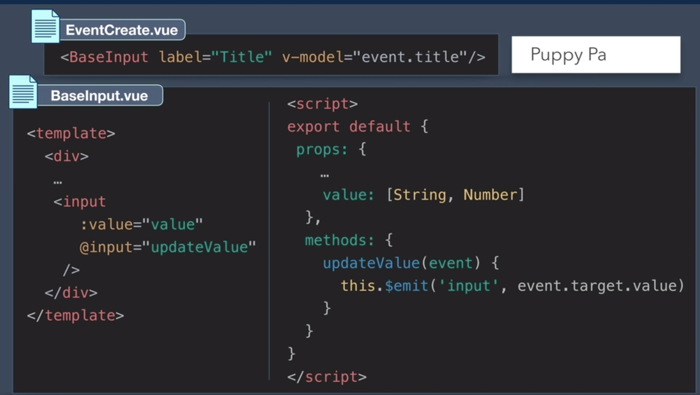
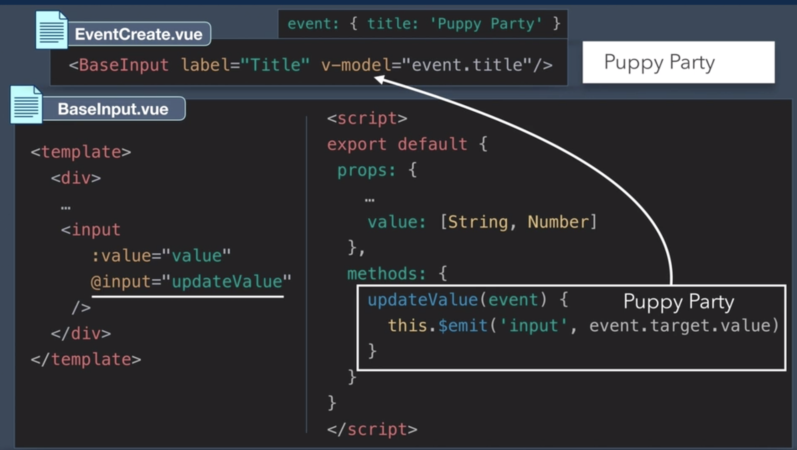
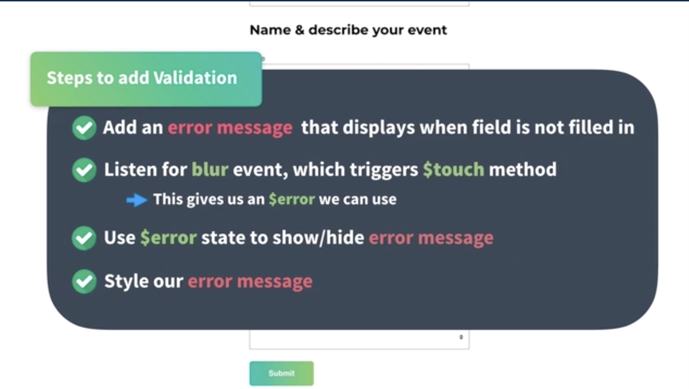

# Components

## Base Components

**Passing events to the base component**

## Adding validation to form compnents using `vuelidate`

`$touch` is a method to make `$dirty` true. A combination of `$dirty` and `$invalid` on a field makes the `$error` field `true`.

[Vuelidate](https://vuelidate.js.org/#sub-error-vs-any-error)

