## Routes
- With named routes, changing a URL later happens at one point

## NProgess Bar
### Using axios interceptors

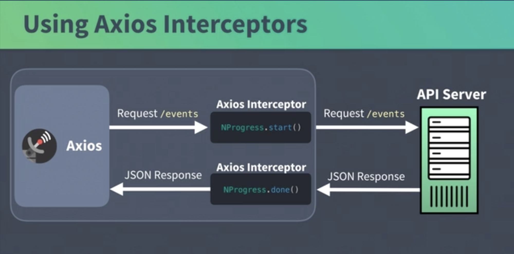

## Vue-Router hooks

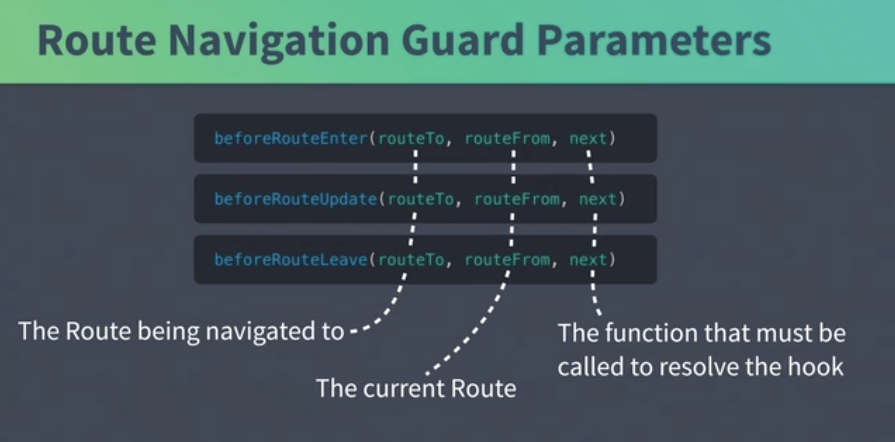

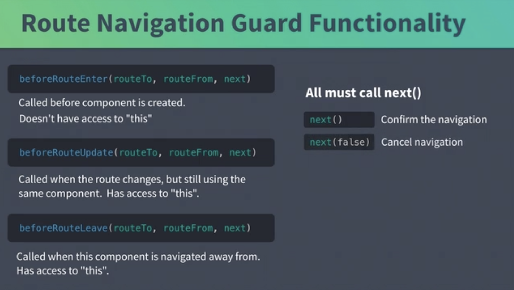

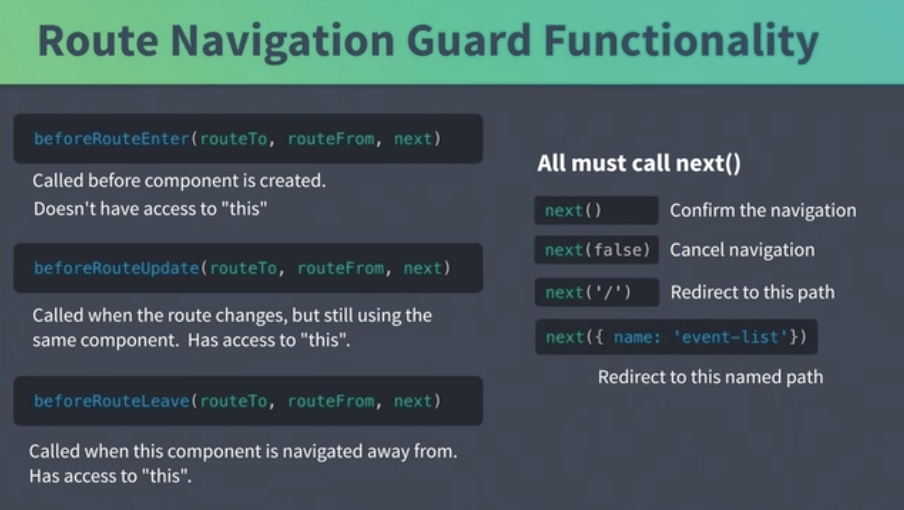

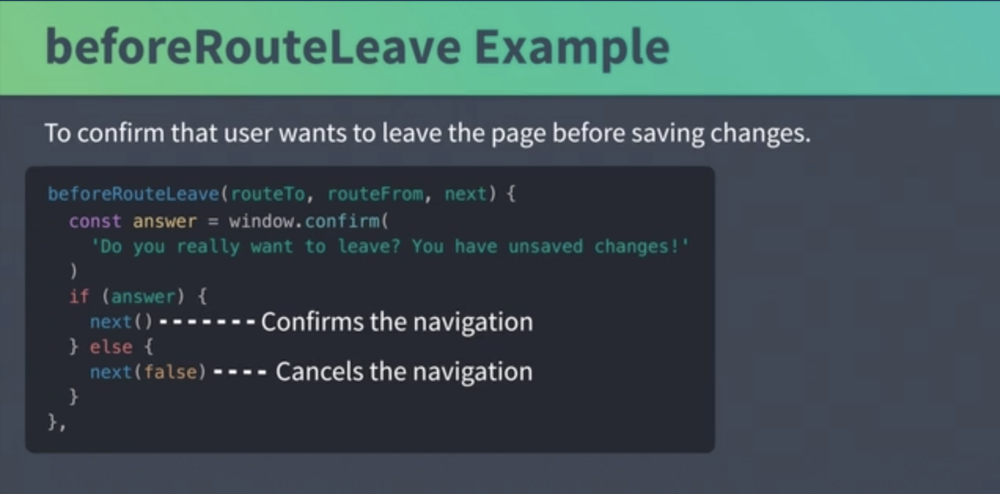

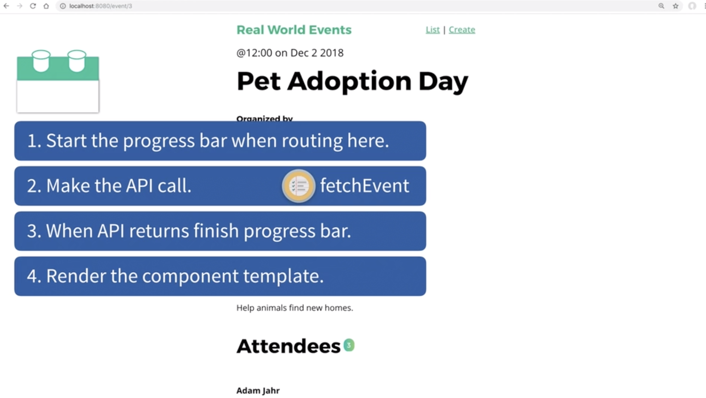

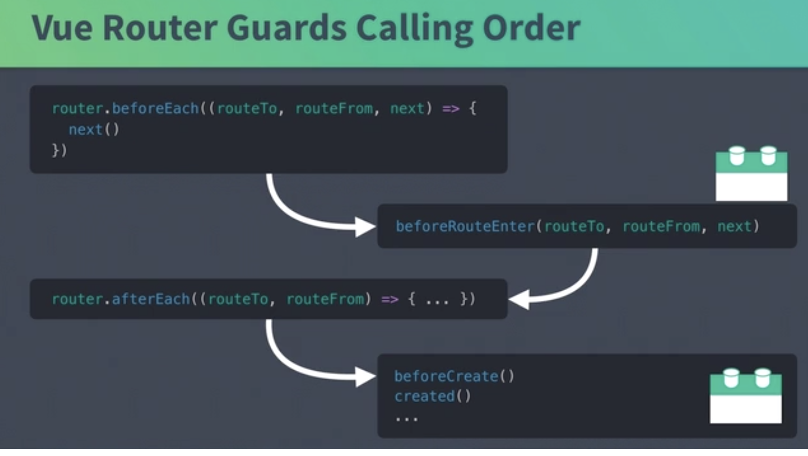

### Global usage of NProgress for every navigation in your app.

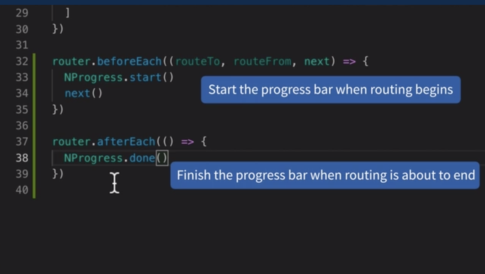

#### Be careful to wait for API calls to return

1. Solution 1

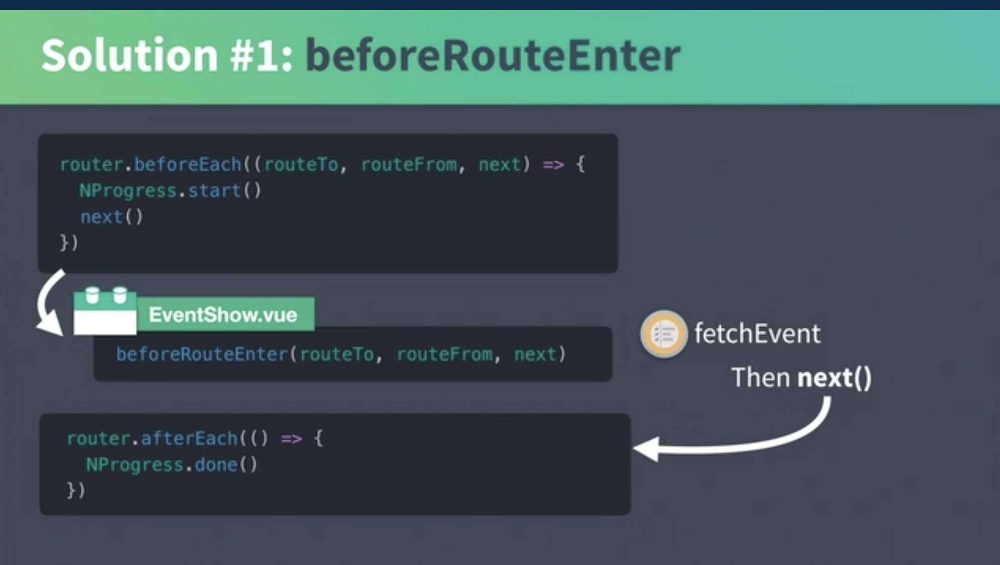

2. Solution 2

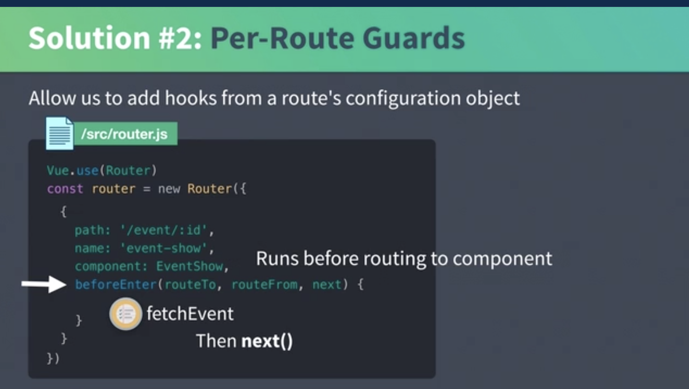

**Calling Order**

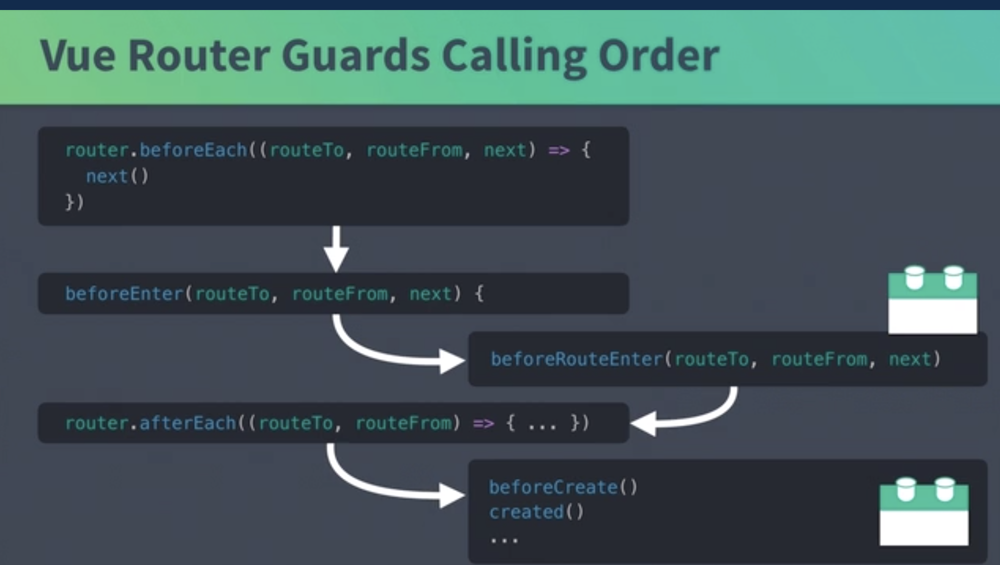